# 🏢 აგენტების ორგანიზაციის მასტერ-გეგმა (Agent Organization Master Map)

ეს დოკუმენტი წარმოადგენს **ცენტრალური AI გუნდის (Central AI Team)** გლობალურ მასტერ-გეგმას. ორგანიზაცია სტრუქტურირებულია ჰაბ-ენდ-სპოუკ (Hub-and-Spoke) მოდელით: ცენტრალური AI ბირთვი (Antigravity და Claude Code) მართავს დამოუკიდებელ პროექტებს და იყენებს საერთო ჰორიზონტალურ დეპარტამენტებს პროფესიონალური მხარდაჭერისთვის.

---

## 🌐 გლობალური ორგანიზაციული რუკა (Global Agent Network)

ორგანიზაციის სტრუქტურა აერთიანებს ცენტრალურ ბირთვს, ჰორიზონტალურ დეპარტამენტებს და განშტოებულ პროექტებს:

```mermaid
graph TD
    %% Central Hub
    subgraph Core [ცენტრალური AI ბირთვი]
        A[ცენტრალური AI გუნდი] --> A1[Antigravity <br> Google DeepMind]
        A --> A2[Claude Code <br> Anthropic]
        A --> B[აგენტების საბჭო - Council]
    end

    %% Project Branches
    A --> P1[Aftersales Intelligence <br> Porsche PDF Reader]
    A --> P2[BMW Motorrad <br> Expert Tool]
    A --> P3[Future Projects <br> სამომავლო კონცეფციები]

    %% Supporting Wings
    A --> C[საინჟინრო & ტექნიკური ფრთა]
    A --> D[შემოქმედებითი & ბრენდის ფრთა]
    
    %% technical
    C --> C1[თარჯიმნების დეპარტამენტი]
    C --> C2[Data & Tech Architecture]
    C --> C3[Cybersecurity & Compliance]
    C --> C4[R&D Lab]
    C --> C5[Tech Innovation & Optimization]
    C --> C6[არქივის დეპარტამენტი]
    
    C6 --> C6_1[არქივარიუსი - Archivist]
    C3 --> C3_4[Spec Validator - Torque Auditor]
    C2 --> C2_4[Local Edge AI Specialist]
    C --> C7[Web Reach Department]
    C7 --> C7_1[Agent Reach Specialist]
    
    %% creative
    D --> D1[მარკეტინგის დეპარტამენტი]
    D --> D2[Cockpit UI/UX Studio]
    D --> D3[Aftersales CX & Analytics]

    %% UI/UX Studio Agents
    D2 --> D2_1[Premium Visual Architect]
    D2 --> D2_2[Micro-Interaction Specialist]
    D2 --> D2_3[Usability Engineer]
    D2 --> D2_4[Porsche Brand Guardian]
    D2 --> D2_5[DOM Auditor]
    D2 --> D2_6[Widget Scout]
    D2 --> D2_7[Framework Architect]
    D2 --> D2_8[Digital Twin Architect]

    %% Styling highlights
    style C2 fill:#1c1c24,stroke:#0096ff,stroke-width:2px,color:#fff
    style C3 fill:#1c1c24,stroke:#88d413,stroke-width:2px,color:#fff
    style C4 fill:#1c1c24,stroke:#9933ff,stroke-width:2px,color:#fff
    style C5 fill:#1c1c24,stroke:#ffcc00,stroke-width:2px,color:#fff
    style C7 fill:#1c1c24,stroke:#00d2ff,stroke-width:2px,color:#fff
    style D2 fill:#1c1c24,stroke:#d5001c,stroke-width:2px,color:#fff
    style D3 fill:#1c1c24,stroke:#ff9900,stroke-width:2px,color:#fff
    style B1 fill:#0f0f12,stroke:#d09e3a,stroke-width:1px
    style D2_4 fill:#1c1c24,stroke:#d5001c,stroke-dasharray: 5 5
    style D2_5 fill:#1c1c24,stroke:#d5001c,stroke-dasharray: 5 5
    style D2_6 fill:#1c1c24,stroke:#d5001c,stroke-dasharray: 5 5
    style D2_7 fill:#1c1c24,stroke:#d5001c,stroke-dasharray: 5 5
```

---

# 🧠 ფრთა I: სტრატეგიული ბირთვი (Strategic Core)

## 👥 აგენტების საბჭო (Council of Agents)

> [!IMPORTANT]
> **დეპარტამენტის მასტერ-დოკუმენტი:** 5 დამოუკიდებელი მრჩეველი (კონტრარიანი, პირველადი პრინციპები, ექსპანსიონისტი, აუტსაიდერი, შემსრულებელი) ნებისმიერ გადაწყვეტილებას „წნეხის ქვეშ" ამოწმებს. სრული მასტერ-პრომპტი იხილეთ ცალკე დოკუმენტში:
> 👉 **[[Council]]**

---

# ⚙️ ფრთა II: საინჟინრო & ტექნიკური ფრთა (Engineering Wing)

## 🔀 დეპარტამენტი 1: თარჯიმნების დეპარტამენტი (Translation Department)

> [!NOTE]
> **დეპარტამენტის მასტერ-დოკუმენტი:** 4-აგენტიანი კონვეიერი (Technical Translator → EV Specialist → QA Engineer → Tone of Voice) + ვერიფიკატორი ქვე-აგენტი და 1056-ტერმიანი მასტერ-ლექსიკონი. იხილეთ ცალკე დოკუმენტში:
> 👉 **[[Translation Department]]**

---

## 📊 დეპარტამენტი 2: მონაცემთა ინჟინერია და სისტემური არქიტექტურა (Data & Tech Architecture)

> [!IMPORTANT]
> **დეპარტამენტის მასტერ-დოკუმენტი:** სრული დეტალები, მონაცემთა ბაზის სქემები და არქიტექტურული პრომპტები იხილეთ ცალკე დოკუმენტში:
> 👉 **[[Data Tech Architecture]]**

---

## 🛡️ დეპარტამენტი 3: კიბერუსაფრთხოება და შესაბამისობა (Cybersecurity & Compliance)

> [!WARNING]
> **დეპარტამენტის მასტერ-დოკუმენტი:** სრული დეტალები, უსაფრთხოების წესები და ტესტირების პრომპტები იხილეთ ცალკე დოკუმენტში:
> 👉 **[[Cybersecurity Compliance]]**

---

## 🔬 დეპარტამენტი 4: ინოვაციებისა და კვლევების ლაბორატორია (R&D Lab)

> [!NOTE]
> **დეპარტამენტის მასტერ-დოკუმენტი:** სრული დეტალები, AR და IoT ტელემეტრიის პრომპტები იხილეთ ცალკე დოკუმენტში:
> 👉 **[[RD Lab]]**

---

## 💡 დეპარტამენტი 5: ინოვაციებისა და ტექნოლოგიური ოპტიმიზაციის დეპარტამენტი (Tech Innovation & Optimization)

> [!TIP]
> **დეპარტამენტის მასტერ-დოკუმენტი:** სრული დეტალები, პროაქტიული ჰოსტინგის სკაუტინგისა და AI/API როტაციის პრომპტები იხილეთ ცალკე დოკუმენტში:
> 👉 **[[Innovation Department]]**

---

## 📂 დეპარტამენტი 6: არქივის დეპარტამენტი (Archive Department)

> [!NOTE]
> **დეპარტამენტის მასტერ-დოკუმენტი:** სრული დეტალები, დაარქივებული პროექტების Ledger და არქივარიუსის პრომპტები იხილეთ ცალკე დოკუმენტში:
> 👉 **[[Archive Department]]**

---

## 🌐 დეპარტამენტი 7: ვებ-კავშირის დეპარტამენტი (Web Reach Department)

> [!NOTE]
> **დეპარტამენტის მასტერ-დოკუმენტი:** სრული დეტალები, არხების სტატუსები და აგენტების ვებ-წვდომის წესები იხილეთ ცალკე დოკუმენტში:
> 👉 **[[Web Reach Department]]**

---

# 🎨 ფრთა III: შემოქმედებითი & ბრენდის ფრთა (Creative & Brand Wing)

## 🖲️ დეპარტამენტი 8: ინტერფეისისა და პრემიუმ ესთეტიკის სტუდია (Cockpit UI/UX Studio)

> [!NOTE]
> **დეპარტამენტის მასტერ-დოკუმენტი:** სრული დეტალები, მიზნები და 8 აგენტის პრომპტები იხილეთ ცალკე დოკუმენტში:
> 👉 **[[Cockpit UI UX Studio]]**

---

## 📢 დეპარტამენტი 9: მარკეტინგის დეპარტამენტი (Marketing Department)

> [!TIP]
> **დეპარტამენტის მასტერ-დოკუმენტი:** ბრენდის მკვლევარი, ვიზუალური იდენტობის ექსპერტი და კრეატიული სტრატეგი — სრული მარკეტინგული დაზვერვის გუნდი. იხილეთ ცალკე დოკუმენტში:
> 👉 **[[Marketing Department]]**

---

## 📈 დეპარტამენტი 10: მომხმარებლის გამოცდილება და ანალიტიკა (Aftersales CX & Analytics)

> [!TIP]
> **დეპარტამენტის მასტერ-დოკუმენტი:** სრული დეტალები, ნორმა-საათების ალგორითმები და CX პრომპტები იხილეთ ცალკე დოკუმენტში:
> 👉 **[[Aftersales CX Analytics]]**

---

## 🔗 დაკავშირებული დოკუმენტები Obsidian-ში:
* 📂 **პორშეს გლობალური გეგმა:** [[Aftersales Intelligence]]
* 📂 **BMW Motorrad-ის გლობალური გეგმა:** [[BMW Motorrad Core]] ან [BMW Motorrad Core.md](file:///C:/Users/User/Desktop/AftersaleBrainstorm/Aftesale/BMW%20Motorrad/BMW%20Motorrad%20Core.md)
* 📇 **აგენტების რეესტრი:** [[Agent Registry]] ან [Agent Registry.md](file:///C:/Users/User/Desktop/AftersaleBrainstorm/Aftesale/Central%20AI%20Team/Agent%20Registry.md)
* 👥 **აგენტების საბჭო:** [[Council]]
* 👥 **საბჭოს სხდომა (BMW Expert Tool):** [[council_bmw_expert_tool]] ან [council_bmw_expert_tool.md](file:///C:/Users/User/Desktop/AftersaleBrainstorm/Aftesale/BMW%20Motorrad/council_bmw_expert_tool.md)
* 👥 **საბჭოს სხდომა (ორგანიზაციის გაფართოება):** [[council_organization_expansion]]
* 🔀 **თარჯიმნების დეპარტამენტი:** [[Translation Department]]
* 📢 **მარკეტინგის დეპარტამენტი:** [[Marketing Department]]
* 🛡️ **კიბერუსაფრთხოების დეპარტამენტი:** [[Cybersecurity Compliance]]
* 📈 **ანალიტიკის დეპარტამენტი:** [[Aftersales CX Analytics]]
* 🔬 **კვლევითი ლაბორატორია:** [[RD Lab]]
* 💡 **ინოვაციების დეპარტამენტი:** [[Innovation Department]]
* 📂 **არქივის დეპარტამენტი:** [[Archive Department]]
* 🔗 **ოპერაციული მილსადენი:** [[Research to Production Pipeline]]
* 🔑 **Google Gemini გასაღებების რეზერვი:** [[gemini_keys]]
* 🔑 **Groq API გასაღებების რეზერვი:** [[groq_keys]]
* 🚀 **ორგანიზაციის გაფართოების გეგმა:** [[Organization Expansion Proposal]]
* 🏛️ **აგენტების საბჭოს წარდგენა (Agentic Teams):** [[agentic_teams_proposal]]
* 🏆 **ჰაკატონის გამარჯვებული სეტაპის ანალიზი (ECC Lessons):** [[ecc_lessons_proposal]]

