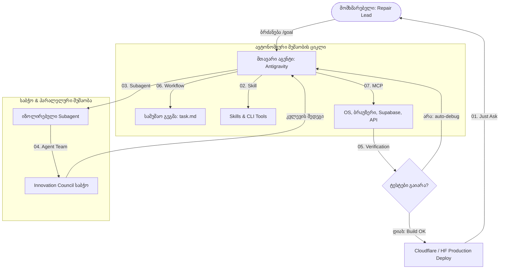

# 🚀 Antigravity Agentic Efficiency: 7-Step Premium Execution Strategy
**შემუშავებულია სპეციალურად:** პორშეს Aftersales ინოვაციების საბჭოსთვის (Innovation Council)  
**ავტორი:** Antigravity (Cockpit UI/UX Studio & Future Tech Architect)  
**სტატუსი:** 💎 სტრატეგიული რეკომენდაცია საბჭოსთვის (P0)

LinkedIn-ზე გამოქვეყნებული პოსტი აბსოლუტურად ზუსტად ასახავს 2026 წლის უახლეს **აგენტურ რეალობას (Agentic Workflows)**. დღეს AI-თან მუშაობა აღარ არის მხოლოდ „კითხვა-პასუხი“ (Simple Prompting). ეს არის **საინჟინრო ეკოსისტემა**, სადაც ხელოვნური ინტელექტი მოქმედებს როგორც ავტონომიური პარტნიორი.

ქვემოთ მოცემულია ამ 7 პრინციპის ღრმა ანალიზი, მათი სრული შესაბამისობა **Antigravity**-ის არქიტექტურასთან და ის კონკრეტული სარგებელი, რასაც ეს პლატფორმა აძლევს Porsche Aftersales-ის პროექტს.

---

## 📊 7 აგენტური პარადიგმა: Claude Code vs. Antigravity

| # | ეტაპი / კონცეფცია | Claude Code პრინციპი | Antigravity ნატიური იმპლემენტაცია | რას აძლევს ეს პროექტს & საბჭოს? |
|---|---|---|---|---|
| **01** | **One quick thing** | `just ask` (სწრაფი კითხვა) | **სწრაფი საინჟინრო ბრძანებები** (Cwd-ში ფაილების პოვნა, syntax-ის გასწორება) | დროის ნულოვანი კარგვა. მცირე შეცდომების მყისიერი აღმოფხვრა კოდის ბაზაში. |
| **02** | **A thing you repeat** | `Skill` (შენახული ცოდნა) | **Antigravity Skills & CLI** (ინსტრუქციების, ტესტების და სკრიპტების ბიბლიოთეკა) | განმეორებადი ამოცანების (მაგ. Supabase-თან სინქრონიზაცია, PDF ქეშირება) 100%-ით სტანდარტიზებული შესრულება. |
| **03** | **A messy side task** | `Subagent` (იზოლირებული აგენტი) | **Subagent Framework** (`define_subagent` & `invoke_subagent`) | **კონტექსტის ჰიგიენა.** რთული კვლევები (მაგ. Gemini API კვოტის პრობლემა) ბარდება Subagent-ს, სანამ მთავარი აგენტი აგრძელებს კოდირებას. |
| **04** | **A small crew that talks** | `Agent Team` (აგენტების გუნდი) | **Innovation Council საბჭო** (Infrastructure Scout, API Expert, Tech stack Visionary) | **მრავალმხრივი ხარისხის კონტროლი.** როლების გადანაწილება (UI/UX ერგონომიკა, CSS ვალიდაცია, ბექენდ არქიტექტურა) და გადამოწმება. |
| **05** | **Keep going till it's true** | `/goal` (მიზანზე ორიენტაცია) | **Goal-Oriented Planning & Verification** (Planning Mode -> Task.md -> Auto-test loop) | **ნულოვანი ადამიანური ჩარევა.** აგენტი მუშაობს მანამ, სანამ კოდი წარმატებით არ აეწყობა (Build Success) და ტესტები 100%-ით არ გაივლის. |
| **06** | **A giant parallel job** | `Workflow` (მრავალნაბიჯიანი პროცესი) | **Planning & Task.md Engine** (პარალელური ფონური ტასკები, Cloudflare Builds) | დიდი მასშტაბის ტრანსფორმაციების მართვა. კოდის წერის პარალელურად ფონური ვალიდაციების გაშვება. |
| **07** | **Plug into your apps** | `MCP / CLI` (ხიდი გარე სამყაროსთან) | **Model Context Protocol (MCP)** & OS Terminal Integration | **რეალური ქმედებები რეალურ გარემოში.** წვდომა ფაილებთან, დესკტოპთან, Supabase ბაზასთან, გარე API-ებთან და ბრაუზერთან. |

---

## 🗺️ Antigravity აგენტური არქიტექტურა (Mermaid Diagram)

ეს დიაგრამა აჩვენებს, თუ როგორ მუშაობს ეს 7 კომპონენტი სინქრონულად ჩვენს Porsche Aftersales პროექტში:

---

## 💎 რას აძლევს ეს მიდგომა საბჭოს (Innovation Council) და Porsche-ს პროექტს?

1. **პროექტის წარმოების სიჩქარე (Velocity):**  
   Subagents-ის გამოყენებით ჩვენ შეგვიძლია პარალელურად ვაწარმოოთ კვლევა (მაგალითად, API კვოტების ოპტიმიზაციაზე) და რეალური ფრონტენდ დეველოპმენტი (Cockpit UI/UX Studio). ეს 2-ჯერ ამცირებს პროექტის ჩაბარების დროს.

2. **უმაღლესი ხარისხის გარანტია (Zero-Bug Policy via /goal):**  
   ავტონომიური ვერიფიკაციის ციკლი ნიშნავს, რომ კოდი არასოდეს იტვირთება გიტზე ტესტირების გარეშე. ჩვენს ბოლო სმოლ-სპრინტებში ეს აშკარად გამოჩნდა: საათის ისრების კორექტირება და საბეჭდი ფურცლის ოპტიმიზაცია მომენტალურად შემოწმდა ბრაუზერში და მხოლოდ ამის შემდეგ მოხდა `git push`.

3. **გარე სისტემებთან სრულყოფილი კავშირი (Premium Integrations):**  
   MCP-ის მეშვეობით, აგენტი პირდაპირ უკავშირდება თქვენს ლოკალურ ფაილებს (მაგ. დესკტოპზე PDF ფაილების ანალიზი) და გარე სერვისებს (Supabase pgvector ბაზა). ეს გამორიცხავს ხელით ინფორმაციის კოპირების საჭიროებას.

---

> [!TIP]
> **საბჭოს რეკომენდაცია (P0):**  
> რეკომენდებულია საბჭოს სხდომაზე [[Innovation Department]] ამ 7 პრინციპის ოფიციალური დამტკიცება, როგორც Aftersales დეველოპმენტის მთავარი სტანდარტი. ეს უზრუნველყოფს, რომ ჩვენი გუნდი მუდამ გამოიყენებს Antigravity-ის რესურსების 100%-ს.
