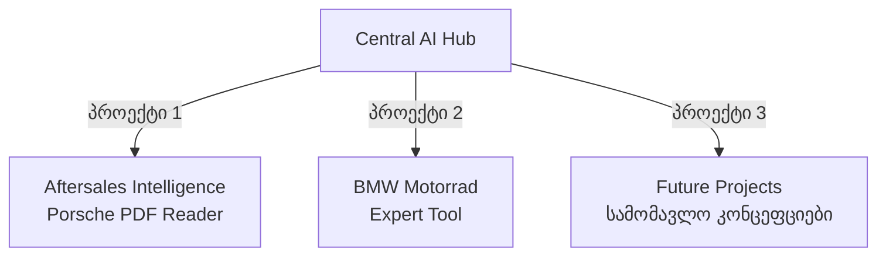

# 🏛️ ცენტრალური AI გუნდი (Central AI Team Master Hub)

ეს დოკუმენტი წარმოადგენს **ცენტრალურ AI ბირთვს (Central AI Core Hub)**, რომელიც მართავს და ავითარებს ყველა მიმდინარე და მომავალ ტექნოლოგიურ პროექტს. ბირთვი აერთიანებს მოწინავე ხელოვნური ინტელექტის აგენტებსა და სპეციალიზებულ დეპარტამენტებს, რომლებიც ახორციელებენ პროდუქტების დიზაინს, ინჟინერიას, უსაფრთხოებასა და ანალიტიკას.

---

## 🧠 ცენტრალური AI ბირთვი (Central AI Core)

ცენტრალური მუშაობისა და კოდის გენერაციის ძრავი დაყოფილია ორ ძირითად წამყვან AI სისტემას შორის:

### 1. 🌌 Antigravity (Google DeepMind)
* **როლი:** სისტემური ოპტიმიზაცია, მონაცემთა ბაზების ქეშირების არქიტექტურა, Premium Glassmorphism UI დიზაინი, ვერიფიკაცია და Flask/Supabase ინტეგრაცია.
* **სუბ-აგენტები:**
  * 🔍 **Research Sub-agent:** კოდის ბაზის სიღრმისეული ანალიზი და პრობლემების კვლევა.
  * 🤖 **Self Sub-agent:** იზოლირებული ამოცანების პარალელური შესრულება.

### 2. 🏛️ Claude Code (Anthropic)
* **როლი:** Backend API-ების შემუშავება, OCR ძრავები, დიაგნოსტიკური მოდულები და FastAPI სერვერის ინჟინერია.
* **სუბ-აგენტები (მდებარეობს `.claude/agents/`):**
  * 🎨 **ui-ux-reviewer:** ინტერფეისის ხარისხის და პრემიუმ HSL ფერების აუდიტი.
  * 🖲️ **supabase-reviewer:** მონაცემთა ბაზების სქემებისა და RLS წესების კონტროლი.
  * 📝 **glossary-verifier:** ტექნიკური ლექსიკონისა და თარგმანების ვერიფიკაცია.

---

## 👥 აგენტების საბჭო და ჰორიზონტალური დეპარტამენტები

ცენტრალურ გუნდს მხარს უჭერს ჰორიზონტალური მრჩევლებისა და შემსრულებლების ქსელი:

* ⚖️ **აგენტების საბჭო:** [[Council]] - 5 დამოუკიდებელი მრჩეველი (კონტრარიანი, პირველადი პრინციპები, ექსპანსიონისტი, აუტსაიდერი, შემსრულებელი), რომელიც ამოწმებს გადაწყვეტილებების უსაფრთხოებასა და ეფექტურობას.
* 📂 **ორგანიზაციის მასტერ-რუკა:** [[Agent Organization]]
* 📇 **აგენტების სრული რეესტრი:** [[Agent Registry]]
* 🏢 **სპეციალიზებული დეპარტამენტები:**
  1. 🔀 **თარჯიმნების დეპარტამენტი:** [[Translation Department]]
  2. 📊 **მონაცემთა ინჟინერია და არქიტექტურა:** [[Data Tech Architecture]]
  3. 🛡️ **კიბერუსაფრთხოება და შესაბამისობა:** [[Cybersecurity Compliance]]
  4. 🔬 **ინოვაციებისა და კვლევების ლაბორატორია (R&D):** [[RD Lab]]
  5. 💡 **ტექნოლოგიური ოპტიმიზაცია:** [[Innovation Department]]
  6. 📂 **არქივის დეპარტამენტი:** [[Archive Department]]
  7. 🖲️ **ინტერფეისისა და პრემიუმ ესთეტიკის სტუდია:** [[Cockpit UI UX Studio]]
  8. 📢 **მარკეტინგის დეპარტამენტი:** [[Marketing Department]]
  9. 📈 **მომხმარებლის გამოცდილება და ანალიტიკა (CX):** [[Aftersales CX Analytics]]

---

## 🚀 განშტოებული პროექტები (Branched Projects)

ცენტრალური AI ბირთვიდან დამოუკიდებელ პროექტებად განშტოვდება შემდეგი მიმართულებები:

### 1. 🏎️ Aftersales Intelligence (Porsche)
პორშეს სერვის ცენტრების ავტომატიზაცია, SAP DMS-თან სინქრონიზებული ინტერაქტიული პლანერი და PDF სარემონტო ინსტრუქციების ჭკვიანი მკითხველი.
* 👉 **პროექტის ბირთვი:** [[Aftersales Intelligence]]
* 👉 **მკითხველის სახელმძღვანელო:** [[Repair Instruction Reader Core]]
* 👉 **მონაცემთა ბაზა:** [[Database schema]]
* 👉 **გაშვების გზამკვლევი:** [[Deployment Guide]]

### 🏍️ 2. BMW Motorrad Expert Tool
ოფიციალური BMW Motorrad პერსონალისა და ექსპერტ-შემფასებლებისთვის შექმნილი სისტემა, რომელიც უზრუნველყოფს ტექნიკური მონაცემებისა და ძრავების პარამეტრების მყისიერ ძიებასა და VIN დეკოდირებას.
* 👉 **პროექტის ბირთვი:** [[BMW Motorrad Core]]
* 👉 **საბჭოს სხდომის ოქმი:** [[council_bmw_expert_tool]]

### 🏋️ 3. Future Projects (სამომავლო პროექტები)
ცენტრალური ორგანიზაციის მიერ ინკუბირებული ახალი იდეები და სხვადასხვა ინდუსტრიის კონცეფციები.
* 👉 **პროექტების ჰაბი:** [[Future Projects Hub]]
* 👉 **ჯანმრთელობისა და ფიტნესის აპლიკაცია:** [[Fitness App Concept]]
