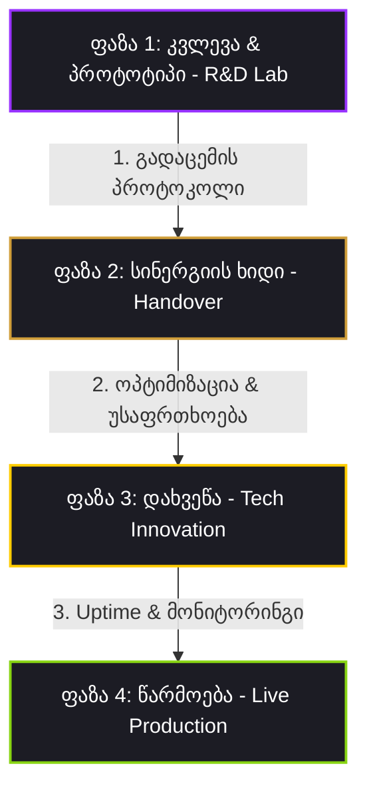

# 📂 დეპარტამენტი 7: არქივის დეპარტამენტი (Archive Department)

ეს დოკუმენტი წარმოადგენს პორშეს Aftersales პროექტის **არქივის დეპარტამენტის** ოფიციალურ მასტერ-დოკუმენტს. დეპარტამენტი პასუხისმგებელია ყველა იმ პროექტის, გეგმის, ტექნიკური მახასიათებლისა და არქიტექტურული მონახაზის შენახვაზე, რომელთა განხორციელებაც დროებით გადაიდო ან შეჩერდა.

---

## 👥 დეპარტამენტის ბირთვი: არქივარიუსი (The Archivist)

არქივის დეპარტამენტში მოქმედებს ერთი სპეციალიზებული AI სპეციალისტი:

### 👤 აგენტი: არქივარიუსი (Archivist Agent)
* **როლი:** პროექტების უსაფრთხო ledgers-ის მართვა, ვერსიონირება და სრული ტექნიკური აღდგენა.
* **მთავარი ფუნქცია:** უზრუნველყოს, რომ არცერთი საინჟინრო იდეა ან კოდის მონახაზი არ დაიკარგოს. საჭიროების შემთხვევაში, პირველივე მოთხოვნაზე სრული სიზუსტით აღადგინოს და დაუბრუნოს სამუშაო ჯგუფს ნებისმიერი პროექტი.

---

## 🗃️ დაარქივებული პროექტების რეესტრი (Archive Ledger)

### 📁 პროექტი 1: ტეგეტა მოტორსის ERP სისტემასთან ინტეგრაცია (1-Click შეკვეთა)
* **სტატუსი:** დაარქივებული (Archived) - 2026-05-31
* **მიზეზი:** საწყობში ნაწილების ნაშთების (Live Stock) საჯაროდ ჩვენება ამ ეტაპზე ვერ მოხერხდება უსაფრთხოებისა და ERP-ის ღია API-ს არარსებობის გამო.
* **ტექნიკური კონცეფცია:**
  * მექანიკოსისთვის საწყობში ნაწილების ხელმისაწვდომობის მომენტალური შემოწმება.
  * 1 წამში შეკვეთის მოთხოვნის გაგზავნა (1-Click Order) უშუალოდ Tegeta ERP-ში.
  * საჭიროა მომავალში შეიქმნას უსაფრთხო API Gateway (Supabase + local Tegeta ERP connector).

---

### 📁 პროექტი 2: OBD-II / PIWIS ვირტუალური სენსორების სიმულატორი & გადაწყვეტილების ხეები
* **სტატუსი:** დაარქივებული (Archived) - 2026-05-31
* **მიზეზი:** რეალურ დიაგნოსტიკის აპარატთან ინტეგრაციის სტრატეგიის დაზუსტება და დაგეგმვა.
* **სრული ტექნიკური გეგმა & არქიტექტურა:**

#### ა) HTML სტრუქტურის მონახაზი (ინექცია right-pane-ში):
```html
<div class="panel piwis-panel glassmorphism">
    <div class="panel-header">
        <h2><i class="fa-solid fa-gauge-high"></i> OBD-II / PIWIS ვირტუალური კოკპიტი</h2>
        <span class="piwis-online-badge"><span class="pulse-dot green"></span> live</span>
    </div>
    <div class="piwis-grid">
        <div class="piwis-section">
            <h3><i class="fa-solid fa-sliders"></i> სენსორების მართვა (Telemetry Sweep)</h3>
            <div class="piwis-control-group">
                <div class="slider-header">
                    <span>დროსელის პოზიცია (TPS)</span>
                    <span id="piwis-tps-val">0%</span>
                </div>
                <input type="range" id="piwis-tps-slider" min="0" max="100" value="0" class="piwis-slider">
            </div>
            <div class="piwis-control-group">
                <div class="slider-header">
                    <span>ამორტიზატორის სიხისტე (PASM)</span>
                    <span id="piwis-pasm-val">30%</span>
                </div>
                <input type="range" id="piwis-pasm-slider" min="0" max="100" value="30" class="piwis-slider">
            </div>
            <div class="piwis-control-group toggle-row">
                <span class="toggle-label"><i class="fa-solid fa-wind"></i> სპორტული გამონაბოლქვი (Exhaust Valve)</span>
                <label class="porsche-switch">
                    <input type="checkbox" id="piwis-exhaust-toggle">
                    <span class="switch-slider"></span>
                </label>
            </div>
        </div>
        <div class="piwis-section dtc-section">
            <h3><i class="fa-solid fa-bug"></i> აქტიური შეცდომები (Active DTCs)</h3>
            <div id="piwis-dtc-log" class="piwis-dtc-log">
                <div class="dtc-item ok-status"><i class="fa-solid fa-circle-check"></i> სისტემა სუფთაა (No Faults)</div>
            </div>
            <div class="piwis-btn-row">
                <button id="piwis-btn-trigger-fault" class="btn-piwis btn-warn"><i class="fa-solid fa-triangle-exclamation"></i> შეცდომის იმიტაცია</button>
                <button id="piwis-btn-clear-dtc" class="btn-piwis btn-success"><i class="fa-solid fa-broom"></i> DTC წაშლა</button>
            </div>
        </div>
    </div>
</div>
```

#### ბ) Flat-Six Web Audio Engine Sound Synthesis:
* დროსელის სლაიდერის მიხედვით იცვლება `OscillatorNode` (sawtooth) ძირითადი და სუბ-სიხშირე ($55\text{ Hz}$-დან $360\text{ Hz}$-მდე).
* Exhaust Valve-ის ტოგლის მიხედვით იცვლება `BiquadFilterNode` (lowpass) cutoff სიხშირე:
  * ჩაკეტილი სარქველი: $240\text{ Hz}$
  * გახსნილი სარქველი (აგრესიული სპორტული ტონი): $1200\text{ Hz}$

#### გ) დიაგნოსტიკური გადაწყვეტილების ხეები (Decision Trees):
* ნაბიჯის ობიექტს ემატება `choices` მასივი:
  ```json
  "choices": [
      { "label_ka": "კი", "next_step": 5 },
      { "label_ka": "არა", "next_step": 6 }
  ]
  ```
* UI-ში იქმნება Yes/No ღილაკები, რომლებზე დაჭერითაც ხდება smooth scroll target ნაბიჯზე და Guards Red ნეონის glow highlight-ის გააქტიურება.

---

### 📁 პროექტი 3: კვლევითიდან-წარმოებამდე ოპერაციული მილსადენი (Research-to-Production Pipeline SOP)
* **სტატუსი:** დაარქივებული (Archived) - Registered Standard on 2026-05-31
* **მიზანი:** R&D-ში შექმნილი ფუტურისტული პროტოტიპების სწრაფი, უსაფრთხო და სტაბილური გადატანა რეალურ წარმოებაში (Production).
* **სტრატეგიული სქემა & ოთხი ფაზა (The 4-Phase Pipeline):**



#### ფაზების კატალოგიზაცია:
1. **ექსპერიმენტული კვლევა და პროტოტიპირება (R&D Lab):** ახალი ტექნოლოგიების შესწავლა, Proof of Concept-ის შექმნა (ნედლი კოდი/სქემები).
2. **სინერგიის ხიდი და გადაცემა (Handover Protocol):** ტექნიკური პასპორტის მომზადება, API ენდფოინთების დოკუმენტირება. R&D კოდის აუდიტი.
3. **ოპტიმიზაცია და უსაფრთხოების დახვეწა (Tech Innovation):** კოდის რეფაქტორინგი, Supabase ქეშირება, ტოკენების ეკონომია, API გასაღებების როტაცია.
4. **წარმოებაში გაშვება და მონიტორინგი (Production Deployment):** Cloudflare/Hugging Face Spaces დეპლოი, Uptime-ის კონტროლი, Live ვიჯეტები.

---

### 📁 პროექტი 4: Google Gemini API გასაღებების რეზერვი (Central%20AI%20Team/gemini_keys.md)
* **სტატუსი:** დაარქივებული (Archived) - Registered Backup on 2026-05-31
* **მიზანი:** Google Gemini API-ს სარეზერვო გასაღებების უსაფრთხო შენახვა ბექენდის Secrets-ებში როტაციისა და საინჟინრო მენიუსთვის.
* **დაარქივებული გასაღებების სტრუქტურა:**
  - 5 Placeholder API გასაღები როტაციისთვის (`AIzaSyB-...`).
  - **ინტეგრაციის მითითება:** გასაღებები მძიმით გამოყოფილი იწერება Hugging Face Space-ის `GEMINI_API_KEY` საიდუმლო ცვლადში შემთხვევითი როტაციისთვის.
  - **საინჟინრო რეჟიმზე წვდომა:** ვებ-გვერდზე Crest-ზე 3-ჯერ დაწკაპუნებით და პაროლით `Suffering1@`.

---

### 📁 პროექტი 5: Groq API გასაღებების რეზერვი (Central%20AI%20Team/groq_keys.md)
* **სტატუსი:** დაარქივებული (Archived) - Registered Backup on 2026-05-31
* **მიზანი:** Groq API-ს უფასო გასაღებების სარეზერვო შენახვა და როტაციის კონფიგურაცია.
* **დაარქივებული გასაღებების სტრუქტურა:**
  - 4 აქტიური/სარეზერვო Groq API გასაღები (`gsk_...`).
  - **ინტეგრაციის მითითება:** გასაღებები მძიმით გამოყოფილი იწერება Hugging Face Space-ის `GROQ_API_KEY` საიდუმლო ცვლადში.

---

### 📁 პროექტი 6: PDF-დან ნახაზების ექსტრაქცია და Timeline-ზე ჩვენება (Signed URLs Supabase-ში და Lightbox UI)
* **სტატუსი:** დაარქივებული (Archived) - 2026-06-05
* **მიზანი:** PDF მანუალებიდან სურათების/ნახაზების ავტომატური ექსტრაქცია და მათი Timeline-ზე უსაფრთხოდ ჩვენება დროებითი ბმულებითა და გადიდების (Lightbox) ფუნქციონალით.
* **მიზეზი:** მომხმარებლის გადაწყვეტილებით სურათების თემა პროექტში გახდა ზედმეტი (redundant), თუმცა კოდის სრული არქიტექტურა და ფუნქციონალი ინახება მომავლისთვის.
* **კოდის არქიტექტურა:**

#### 1. ბექენდის მექანიზმი (Python & PyMuPDF / Supabase)
ბექენდი [main.py](file:///C:/Users/User/Desktop/AftersaleBrainstorm/Aftesale/Aftersales%20Intelligence%20%28Porsche%29/RepairInstructionReader/backend/main.py) ფაილში იყენებს PyMuPDF-ს (`fitz`) PDF-ის გვერდებიდან სურათების ამოსაღებად და მათ Supabase-ის Storage ბაქეტში (`repair-manuals`) ასატვირთად. უსაფრთხოების მიზნით, ფრონტენდს გადაეცემა არა პირდაპირი ბმულები, არამედ დინამიურად გენერირებული დროებითი ხელმოწერილი ბმულები (Signed URLs).

* **მთავარი ფუნქციები:**
  * [extract_and_upload_images](file:///C:/Users/User/Desktop/AftersaleBrainstorm/Aftesale/Aftersales%20Intelligence%20%28Porsche%29/RepairInstructionReader/backend/main.py#L2-L120): PyMuPDF-ის საშუალებით ამოწმებს აქტიურ გვერდებს, ახდენს რასტრული სურათების ექსტრაქციას, ფილტრავს ნაგავს/მცირე იკონებს (<150x150 ან <10KB) და ტვირთავს ბაქეტში. თუ გვერდზე რასტრული სურათი არ არის, ახდენს მთლიანი გვერდის რენდერირებას PNG ფაილად (Fallback).
  * [generate_signed_url](file:///C:/Users/User/Desktop/AftersaleBrainstorm/Aftesale/Aftersales%20Intelligence%20%28Porsche%29/RepairInstructionReader/backend/main.py#L124-L162): Supabase-ის REST API `/storage/v1/object/sign/` ენდფოინთის გამოყენებით ქმნის ხელმოწერილ ბმულს, რომელიც ვალიდურია დროის გარკვეულ მონაკვეთში (მაგ. 3600 წამი).
  * [sign_page_images_in_analysis](file:///C:/Users/User/Desktop/AftersaleBrainstorm/Aftesale/Aftersales%20Intelligence%20%28Porsche%29/RepairInstructionReader/backend/main.py#L166-L200): ანალიზის პასუხში შემავალი ფარდობითი გზების დინამიური გარდაქმნა Signed URL-ებად.
  * დიაგნოსტიკის ენდფოინთები: `/view-cache/{file_hash}` და `/test-signed-url`.

```python
def extract_and_upload_images(pdf_path: str, file_hash: str, active_pages: set) -> dict:
    """
    Extracts embedded diagrams/images from PDF pages using PyMuPDF and uploads them
    to Supabase Storage. Only processes pages listed in active_pages.
    Applies size and dimension filters to discard small icons/arrows.
    """
    supabase_url = os.getenv("SUPABASE_URL", "").strip()
    supabase_key = os.getenv("SUPABASE_KEY", "").replace("\n", "").replace("\r", "").strip()
    
    if not supabase_url or not supabase_key:
        logger.warning("Supabase credentials missing. Skipping diagram extraction.")
        return {}
        
    bucket_name = "repair-manuals"
    page_images = {}
    
    try:
        logger.info(f"Starting diagram extraction for active pages: {active_pages}")
        doc = fitz.open(pdf_path)
        total_pages = len(doc)
        
        for page_num in active_pages:
            if page_num < 1 or page_num > total_pages:
                logger.warning(f"Step page number {page_num} is out of bounds (1-{total_pages}). Skipping.")
                continue
                
            page_idx = page_num - 1
            page = doc[page_idx]
            image_list = page.get_images(full=True)
            page_images[page_num] = []
            
            if not image_list:
                try:
                    logger.info(f"No embedded raster images found on page {page_num}. Rendering page to PNG as fallback...")
                    pix = page.get_pixmap(matrix=fitz.Matrix(1.5, 1.5))
                    image_bytes = pix.tobytes("png")
                    
                    filename = f"images/{file_hash}/page_{page_num}_render.png"
                    url = f"{supabase_url.rstrip('/')}/storage/v1/object/{bucket_name}/{filename}"
                    public_url = f"{supabase_url.rstrip('/')}/storage/v1/object/public/{bucket_name}/{filename}"
                    
                    headers = {
                        "Authorization": f"Bearer {supabase_key}",
                        "apikey": supabase_key,
                        "Content-Type": "image/png"
                    }
                    
                    check_response = requests.head(url, headers=headers)
                    if check_response.status_code == 200:
                        page_images[page_num].append(public_url)
                        logger.info(f"Rendered page {filename} already exists. Reusing public URL.")
                        continue
                        
                    response = requests.post(url, headers=headers, data=image_bytes, timeout=15)
                    if response.status_code in [200, 201]:
                        page_images[page_num].append(public_url)
                        logger.info(f"Successfully rendered and uploaded page {page_num} diagram fallback as {filename}")
                    else:
                        logger.error(f"Failed to upload rendered page {page_num}: {response.status_code} - {response.text}")
                except Exception as re:
                    logger.error(f"Error rendering page {page_num} fallback image: {re}")
                continue
            
            uploaded_count = 0
            for img_idx, img_info in enumerate(image_list):
                if uploaded_count >= 3:
                    break
                    
                xref = img_info[0]
                try:
                    base_image = doc.extract_image(xref)
                    image_bytes = base_image["image"]
                    image_ext = base_image["ext"]
                    width = base_image["width"]
                    height = base_image["height"]
                    
                    if width < 150 or height < 150 or len(image_bytes) < 10240:
                        logger.info(f"Skipping junk image on page {page_num} (dim: {width}x{height}, size: {len(image_bytes)} bytes)")
                        continue
                        
                    filename = f"images/{file_hash}/page_{page_num}_img_{uploaded_count}.{image_ext}"
                    url = f"{supabase_url.rstrip('/')}/storage/v1/object/{bucket_name}/{filename}"
                    public_url = f"{supabase_url.rstrip('/')}/storage/v1/object/public/{bucket_name}/{filename}"
                    
                    headers = {
                        "Authorization": f"Bearer {supabase_key}",
                        "apikey": supabase_key,
                        "Content-Type": f"image/{image_ext}"
                    }
                    
                    check_response = requests.head(url, headers=headers)
                    if check_response.status_code == 200:
                        page_images[page_num].append(public_url)
                        uploaded_count += 1
                        logger.info(f"Diagram {filename} already exists. Reusing public URL.")
                        continue
                        
                    response = requests.post(url, headers=headers, data=image_bytes, timeout=15)
                    if response.status_code in [200, 201]:
                        page_images[page_num].append(public_url)
                        uploaded_count += 1
                        logger.info(f"Successfully uploaded diagram page {page_num} image {img_idx} as {filename}")
                    else:
                        logger.error(f"Failed to upload diagram {filename}: {response.status_code} - {response.text}")
                except Exception as ie:
                    logger.error(f"Error extracting image index {img_idx} from page {page_num}: {ie}")
                    
        return page_images
    except Exception as e:
        logger.error(f"Error during image extraction and upload: {e}")
        return {}


def generate_signed_url(filename: str, expires_in: int = 604800) -> str:
    """Generates a temporary signed URL for a private Supabase Storage object (valid for 7 days)."""
    supabase_url = os.getenv("SUPABASE_URL", "").strip()
    supabase_key = os.getenv("SUPABASE_KEY", "").replace("\n", "").replace("\r", "").strip()
    
    if not supabase_url or not supabase_key:
        logger.warning("Supabase credentials missing. Cannot generate signed URL.")
        return ""
        
    bucket_name = "repair-manuals"
    
    import urllib.parse
    encoded_filename = urllib.parse.quote(filename)
    
    url = f"{supabase_url.rstrip('/')}/storage/v1/object/sign/{bucket_name}/{encoded_filename}"
    
    headers = {
        "Authorization": f"Bearer {supabase_key}",
        "apikey": supabase_key,
        "Content-Type": "application/json"
    }
    
    payload = {"expiresIn": expires_in}
    
    try:
        response = requests.post(url, json=payload, headers=headers, timeout=10)
        if response.status_code == 200:
            data = response.json()
            signed_path = data.get("signedURL")
            if signed_path:
                if not signed_path.startswith("/storage/v1"):
                    signed_path = "/storage/v1" + ("/" if not signed_path.startswith("/") else "") + signed_path
                return f"{supabase_url.rstrip('/')}{signed_path}"
        logger.error(f"Failed to sign URL for {filename}: {response.status_code} - {response.text}")
        return ""
    except Exception as e:
        logger.error(f"Error signing URL for {filename}: {e}")
        return ""


def sign_page_images_in_analysis(data: dict) -> dict:
    """Converts relative image paths in the analysis dict to fresh Signed URLs dynamically."""
    if not data or "page_images" not in data or not isinstance(data["page_images"], dict):
        return data
        
    signed_images = {}
    for page_num, img_paths in data["page_images"].items():
        if not isinstance(img_paths, list):
            signed_images[page_num] = img_paths
            continue
            
        signed_list = []
        for path in img_paths:
            if not isinstance(path, str):
                signed_list.append(path)
                continue
                
            filename = path
            if "storage/v1/object/" in path:
                parts = path.split("repair-manuals/")
                if len(parts) > 1:
                    filename = parts[1]
            
            filename = filename.strip("/")
            
            signed_url = generate_signed_url(filename)
            if signed_url:
                signed_list.append(signed_url)
            else:
                signed_list.append(path)
        signed_images[page_num] = signed_list
        
    response_data = data.copy()
    response_data["page_images"] = signed_images
    return response_data
```

#### 2. ფრონტენდის მექანიზმი (app.js / Lightbox UI)
ფრონტენდი [app.js](file:///C:/Users/User/Desktop/AftersaleBrainstorm/Aftesale/Aftersales%20Intelligence%20%28Porsche%29/RepairInstructionReader/frontend/app.js) ფაილში Timeline-ის ნაბიჯებში რენდერავს ნახაზებს `data.page_images`-დან და მართავს მათ ჩატვირთვასა და გადიდებას.

* **მთავარი მექანიზმები:**
  * **Timeline-ზე ჩვენება:** თითოეულ ნაბიჯზე `page_images`-დან კონკრეტული გვერდის სურათის (Signed URL) ამოღება და `onerror="handleImageError(this, '${step.page_number}')"` დამუშავებით რენდერინგი.
  * [zoomImage](file:///C:/Users/User/Desktop/AftersaleBrainstorm/Aftesale/Aftersales%20Intelligence%20%28Porsche%29/RepairInstructionReader/frontend/app.js#L2013-L2040): ქმნის მოდალურ fullscreen ფანჯარას (Lightbox UI) სურათის გასადიდებლად.
  * [handleImageError](file:///C:/Users/User/Desktop/AftersaleBrainstorm/Aftesale/Aftersales%20Intelligence%20%28Porsche%29/RepairInstructionReader/frontend/app.js#L2043-L2056): იმ შემთხვევაში, თუ სურათი ვერ ჩაიტვირთა (მაგ. ვადაგასული Signed URL), მალავს სურათს და Timeline-ზე მომხმარებელს აჩვენებს შეცდომის შეტყობინებას გვერდის განახლების რეკომენდაციით.

##### ატვირთული დიაგრამის HTML რენდერინგი (Timeline-ის ნაბიჯის შიგნით):
```javascript
// ...
imageTags += ``;
// ...
```

##### Lightbox-ისა და შეცდომების დამუშავების დამხმარე ფუნქციები:
```javascript
// Global function to show full-screen diagram lightbox (needed for inline onclick)
window.zoomImage = function(img) {
    const lightbox = document.createElement("div");
    lightbox.style.position = "fixed";
    lightbox.style.top = "0";
    lightbox.style.left = "0";
    lightbox.style.width = "100%";
    lightbox.style.height = "100%";
    lightbox.style.background = "rgba(0,0,0,0.9)";
    lightbox.style.display = "flex";
    lightbox.style.justifyContent = "center";
    lightbox.style.alignItems = "center";
    lightbox.style.zIndex = "99999";
    lightbox.style.cursor = "zoom-out";
    
    const clone = img.cloneNode();
    clone.style.maxWidth = "90%";
    clone.style.maxHeight = "90%";
    clone.style.borderRadius = "8px";
    clone.style.border = "none";
    clone.style.cursor = "default";
    
    lightbox.appendChild(clone);
    document.body.appendChild(lightbox);
    
    lightbox.onclick = function() {
        document.body.removeChild(lightbox);
    };
};

// Global function to handle image load errors gracefully (e.g. expired signed URLs)
window.handleImageError = function(img, pageNum) {
    console.error(`Failed to load diagram for page ${pageNum}`);
    const container = img.parentElement;
    if (container && !container.querySelector(".diagram-error-msg")) {
        const errorMsg = document.createElement("div");
        errorMsg.className = "diagram-error-msg";
        errorMsg.style.color = "rgba(255, 100, 100, 0.8)";
        errorMsg.style.fontSize = "0.8rem";
        errorMsg.style.marginTop = "5px";
        errorMsg.innerHTML = `<i class="fa-solid fa-circle-exclamation"></i> ნახაზის ჩატვირთვა ვერ მოხერხდა (სცადეთ გვერდის განახლება)`;
        container.appendChild(errorMsg);
    }
    img.style.display = "none";
};
```

---

## ⏱️ სესიების ავტომატური რეესტრი (Automated Session Ledger)

*(საქაღალდე სუფთაა, სესიების ისტორია ჯერ არ დაწყებულა)*


<!-- SESSION_ID: 4e8c0118-fd3f-4d4a-bc2e-85b4689fd09b -->
### 📁 სესია: 2026-06-19 22:04:32 (სესიის ID: 4e8c0118)
* **სტატუსი:** ✅ დასრულებული (Archived)
* **გამოყენებული ხელსაწყოები:** `grep_search`, `list_dir`, `list_permissions`, `run_command`, `view_file`, `write_to_file`
* **შეცვლილი ფაილები:**
- [implementation_plan.md](file:///C:/Users/Admin/.gemini/antigravity/brain/4e8c0118-fd3f-4d4a-bc2e-85b4689fd09b/implementation_plan.md) (`../../.gemini/antigravity/brain/4e8c0118-fd3f-4d4a-bc2e-85b4689fd09b/implementation_plan.md`)
- [task.md](file:///C:/Users/Admin/.gemini/antigravity/brain/4e8c0118-fd3f-4d4a-bc2e-85b4689fd09b/task.md) (`../../.gemini/antigravity/brain/4e8c0118-fd3f-4d4a-bc2e-85b4689fd09b/task.md`)
- [walkthrough.md](file:///C:/Users/Admin/.gemini/antigravity/brain/4e8c0118-fd3f-4d4a-bc2e-85b4689fd09b/walkthrough.md) (`../../.gemini/antigravity/brain/4e8c0118-fd3f-4d4a-bc2e-85b4689fd09b/walkthrough.md`)
- [AGENTS.md](file:///C:/Users/Admin/.gemini/antigravity/scratch/AI_Software_House_Template/.agents/AGENTS.md) (`../../.gemini/antigravity/scratch/AI_Software_House_Template/.agents/AGENTS.md`)
- [AGENTS.md](file:///C:/Users/Admin/.gemini/antigravity/scratch/AI_Software_House_Template/AGENTS.md) (`../../.gemini/antigravity/scratch/AI_Software_House_Template/AGENTS.md`)
- [Marketing Department.md](file:///C:/Users/Admin/.gemini/antigravity/scratch/AI_Software_House_Template/Central AI Team/Departments/Marketing Department.md) (`../../.gemini/antigravity/scratch/AI_Software_House_Template/Central AI Team/Departments/Marketing Department.md`)
- [agent_runner.py](file:///C:/Users/Admin/.gemini/antigravity/scratch/AI_Software_House_Template/Central AI Team/agent_runner.py) (`../../.gemini/antigravity/scratch/AI_Software_House_Template/Central AI Team/agent_runner.py`)
- [README.md](file:///C:/Users/Admin/.gemini/antigravity/scratch/AI_Software_House_Template/README.md) (`../../.gemini/antigravity/scratch/AI_Software_House_Template/README.md`)
- [count_agents.py](file:///C:/Users/Admin/.gemini/antigravity/scratch/count_agents.py) (`../../.gemini/antigravity/scratch/count_agents.py`)
- [write_global_agents.py](file:///C:/Users/Admin/.gemini/antigravity/scratch/write_global_agents.py) (`../../.gemini/antigravity/scratch/write_global_agents.py`)
- [AGENTS.md](file:///C:/Users/Admin/.gemini/config/AGENTS.md) (`../../.gemini/config/AGENTS.md`)
- [AGENTS.md](file:///C:/Users/Admin/Desktop/AI_Software_House_Template/.agents/AGENTS.md) (`.agents/AGENTS.md`)
- [AGENTS.md](file:///C:/Users/Admin/Desktop/AI_Software_House_Template/AGENTS.md) (`AGENTS.md`)
- [Marketing Department.md](file:///C:/Users/Admin/Desktop/AI_Software_House_Template/Central AI Team/Departments/Marketing Department.md) (`Central AI Team/Departments/Marketing Department.md`)
- [agent_runner.py](file:///C:/Users/Admin/Desktop/AI_Software_House_Template/Central AI Team/agent_runner.py) (`Central AI Team/agent_runner.py`)
- [README.md](file:///C:/Users/Admin/Desktop/AI_Software_House_Template/README.md) (`README.md`)
* **განხილული ძირითადი საკითხები (User Prompts):**
  - ანუ რო დამჭრდეს და მოგწერო, კითხე აზრი მარკეტინგის დეპარტამენტს, შვძ₾ებთ მათ გამოყენებას?
  - და სხვა აგენტებთან დაკავშრებით? მაგალითად RD labs ?
  - გაახლე ობსიდიანი ამ წუთს მონაცემებით
  - მიმართე საბჭოს და კითხე  რამდენად ხელმისაწვდომია ჩვენი დეპარტამენტები და  ქვეაგენტები, საჭროებისამებრ გამოყენების მიზნით, სამომავლო პროექტებში?
  - პირველი რიგის ამოცანა
 [Certain] დესკტოპზე არსებული პროექტის ძირში შექმენით README.md ფაილის განახლება, სადაც გაიწერება ინსტრუქცია agent_runner.py-სთვის საჭირო ბიბლიოთეკების დასაყენებლად (pip install google-generativeai anthropic python-dotenv).    გააკეთე
<!-- SESSION_END: 4e8c0118-fd3f-4d4a-bc2e-85b4689fd09b -->