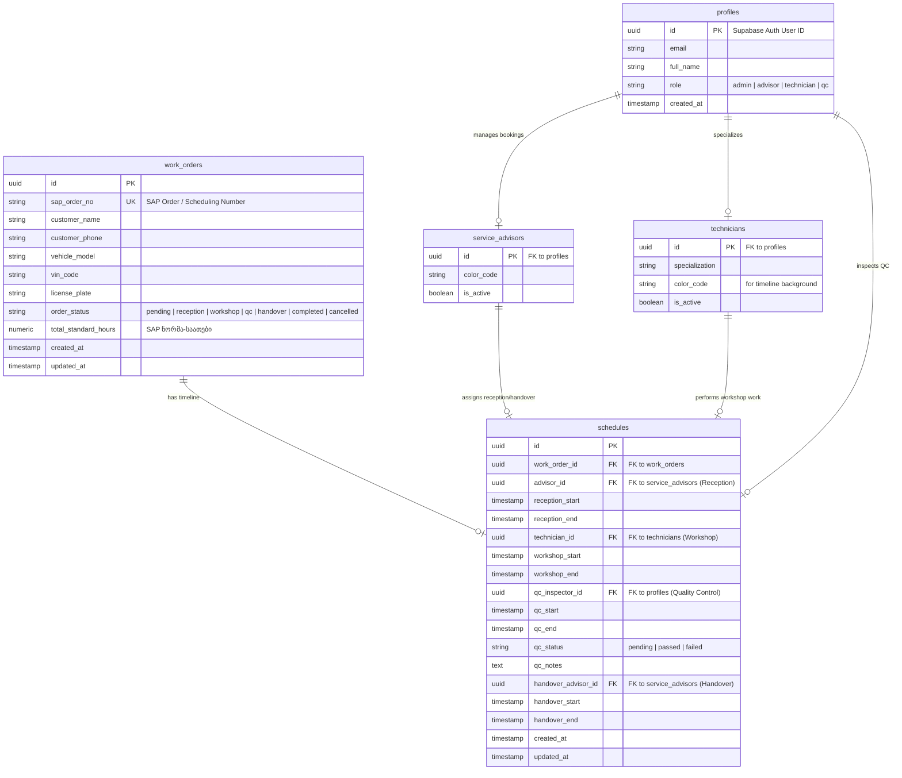

# Supabase მონაცემთა ბაზის სქემა (Database Schema)

ეს დოკუმენტი აღწერს პორშეს Aftersales სქეჯულერისთვის საჭირო მონაცემთა ბაზის (PostgreSQL) სტრუქტურას Supabase-ში. სქემა შექმნილია 4-ეტაპიანი სამუშაო დინების (Reception -> Workshop -> QC -> Handover) და SAP-თან სინქრონიზაციის მხარდასაჭერად.

---

## 📊 სქემის ვიზუალური რუკა (Entity Relationship Diagram)



---

## 🛠️ SQL სკრიპტი (Supabase SQL Editor-ისთვის)

შეგიძლიათ პირდაპირ დააკოპიროთ ეს კოდი Supabase-ის SQL Editor-ში ბაზის შესაქმნელად:

```sql
-- 1. მომხმარებელთა როლების ტიპი (ENUM)
CREATE TYPE user_role AS ENUM ('admin', 'advisor', 'technician', 'qc');

-- 2. შეკვეთის სტატუსების ტიპი (ENUM)
CREATE TYPE order_status AS ENUM ('pending', 'reception', 'workshop', 'qc', 'handover', 'completed', 'cancelled');

-- 3. ხარისხის კონტროლის სტატუსის ტიპი (ENUM)
CREATE TYPE qc_status AS ENUM ('pending', 'passed', 'failed');

-- 4. პროფილების ცხრილი (ავტომატურად ებმება Supabase Auth-ს)
CREATE TABLE public.profiles (
    id UUID REFERENCES auth.users ON DELETE CASCADE PRIMARY KEY,
    email TEXT UNIQUE NOT NULL,
    full_name TEXT NOT NULL,
    role user_role NOT NULL DEFAULT 'advisor',
    created_at TIMESTAMP WITH TIME ZONE DEFAULT TIMEZONE('utc'::text, NOW()) NOT NULL
);

-- 5. ხელოსნების/ტექნიკოსების ცხრილი
CREATE TABLE public.technicians (
    id UUID REFERENCES public.profiles(id) ON DELETE CASCADE PRIMARY KEY,
    specialization TEXT,
    color_code VARCHAR(7) DEFAULT '#1F2937', -- ფერი კალენდარზე გამოსაჩენად (მაგ. hex #FF5733)
    is_active BOOLEAN DEFAULT TRUE NOT NULL
);

-- 6. სერვის-კონსულტანტების ცხრილი
CREATE TABLE public.service_advisors (
    id UUID REFERENCES public.profiles(id) ON DELETE CASCADE PRIMARY KEY,
    color_code VARCHAR(7) DEFAULT '#0F766E',
    is_active BOOLEAN DEFAULT TRUE NOT NULL
);

-- 7. SAP შეკვეთების ცხრილი
CREATE TABLE public.work_orders (
    id UUID DEFAULT gen_random_uuid() PRIMARY KEY,
    sap_order_no TEXT UNIQUE NOT NULL, -- SAP შეკვეთის ნომერი
    customer_name TEXT NOT NULL,
    customer_phone TEXT,
    vehicle_model TEXT NOT NULL,       -- მაგ. Porsche Cayenne, Taycan
    vin_code VARCHAR(17),
    license_plate TEXT,
    order_status order_status DEFAULT 'pending' NOT NULL,
    total_standard_hours NUMERIC(5,2) NOT NULL, -- ნორმა-საათები SAP-იდან
    created_at TIMESTAMP WITH TIME ZONE DEFAULT TIMEZONE('utc'::text, NOW()) NOT NULL,
    updated_at TIMESTAMP WITH TIME ZONE DEFAULT TIMEZONE('utc'::text, NOW()) NOT NULL
);

-- 8. სქეჯულების (დაგეგმარების დაფის) ცხრილი
CREATE TABLE public.schedules (
    id UUID DEFAULT gen_random_uuid() PRIMARY KEY,
    work_order_id UUID REFERENCES public.work_orders(id) ON DELETE CASCADE UNIQUE NOT NULL,
    
    -- ეტაპი 1: Reception (მიღება)
    advisor_id UUID REFERENCES public.service_advisors(id) ON DELETE SET NULL,
    reception_start TIMESTAMP WITH TIME ZONE,
    reception_end TIMESTAMP WITH TIME ZONE,
    
    -- ეტაპი 2: Workshop (სახელოსნო)
    technician_id UUID REFERENCES public.technicians(id) ON DELETE SET NULL,
    workshop_start TIMESTAMP WITH TIME ZONE,
    workshop_end TIMESTAMP WITH TIME ZONE,
    
    -- ეტაპი 3: Quality Control (ხარისხის კონტროლი)
    qc_inspector_id UUID REFERENCES public.profiles(id) ON DELETE SET NULL,
    qc_start TIMESTAMP WITH TIME ZONE,
    qc_end TIMESTAMP WITH TIME ZONE,
    qc_status qc_status DEFAULT 'pending' NOT NULL,
    qc_notes TEXT,
    
    -- ეტაპი 4: Handover (ჩაბარება)
    handover_advisor_id UUID REFERENCES public.service_advisors(id) ON DELETE SET NULL,
    handover_start TIMESTAMP WITH TIME ZONE,
    handover_end TIMESTAMP WITH TIME ZONE,
    
    created_at TIMESTAMP WITH TIME ZONE DEFAULT TIMEZONE('utc'::text, NOW()) NOT NULL,
    updated_at TIMESTAMP WITH TIME ZONE DEFAULT TIMEZONE('utc'::text, NOW()) NOT NULL
);
```

---

## 🔒 უსაფრთხოება და Real-time (Row Level Security & Channels)

იმისათვის, რომ Drag & Drop ცვლილებები მომენტალურად გავრცელდეს ყველა მომხმარებელთან საიტის დარეფრეშების გარეშე, Supabase-ში უნდა ჩაირთოს რეალურ დროში სინქრონიზაცია (Real-time).

### 1. Real-time ჩართვა ცხრილებისთვის:
საკმარისია Supabase-ის მართვის პანელში (Database -> Replication) ჩავრთოთ `schedules` და `work_orders` ცხრილების რეპლიკაცია **Supabase Realtime** არხზე.

ან SQL-ით:
```sql
alter publication supabase_realtime add table public.schedules;
alter publication supabase_realtime add table public.work_orders;
```

### 2. ავტომატური განახლების ტრიგერი (updated_at-ისთვის)
იმისათვის, რომ ყოველ ცვლილებაზე `updated_at` ავტომატურად განახლდეს:
```sql
CREATE OR REPLACE FUNCTION update_modified_column()
RETURNS TRIGGER AS $$
BEGIN
    NEW.updated_at = now();
    RETURN NEW;
END;
$$ language 'plpgsql';

CREATE TRIGGER update_work_orders_modtime BEFORE UPDATE ON public.work_orders FOR EACH ROW EXECUTE PROCEDURE update_modified_column();
CREATE TRIGGER update_schedules_modtime BEFORE UPDATE ON public.schedules FOR EACH ROW EXECUTE PROCEDURE update_modified_column();
```
