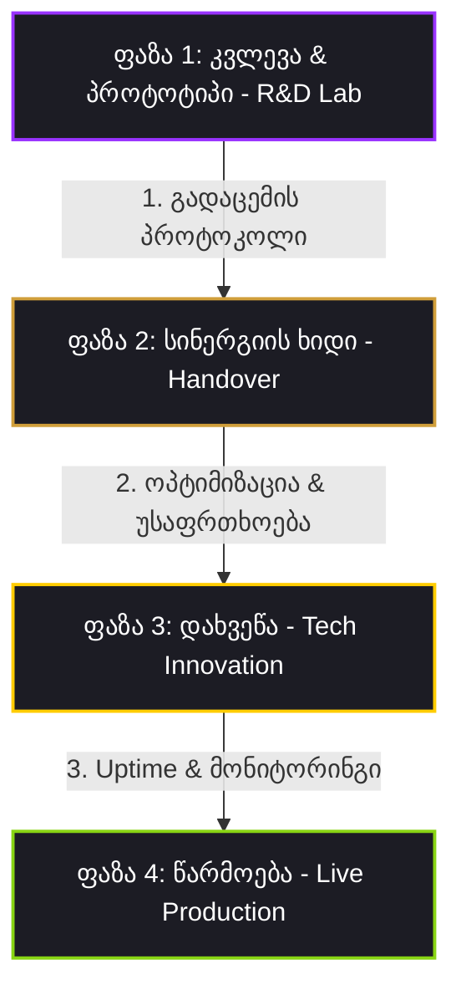

# 🔗 კვლევითიდან-წარმოებამდე ოპერაციული მილსადენი (Research-to-Production Pipeline)

ეს დოკუმენტი წარმოადგენს პორშეს Aftersales პროექტის **R&D Lab-ისა** და **ინოვაციებისა და ტექნოლოგიური ოპტიმიზაციის დეპარტამენტის** კოორდინირებული მუშაობის ოფიციალურ ოპერაციულ სტანდარტს (SOP). 

მილსადენის მიზანია უზრუნველყოს R&D-ში შექმნილი ფუტურისტული პროტოტიპების (AR სათვალეები, OBD-II/CAN-bus ტელემეტრია) სწრაფი, უსაფრთხო და სტაბილური გადატანა რეალურ წარმოებაში (Production).

---

## 🔄 მილსადენის ოთხი ფაზა (The 4-Phase Pipeline)

### 🧪 ფაზა 1: ექსპერიმენტული კვლევა და პროტოტიპირება (R&D Lab)
* **პასუხისმგებელი აგენტი:** Automotive IoT & CAN-bus Specialist / Bleeding-Edge Tech Scout.
* **ამოცანა:** ახალი ტექნოლოგიების შესწავლა და პირველადი, მუშა "Draft" პროტოტიპის შექმნა (Proof of Concept).
* **გამოსავალი (Output):** ექსპერიმენტული Python/JS კოდი, ტელემეტრიის ნედლი სქემები ან AR ინტერფეისის მონახაზები.

### 🌉 ფაზა 2: სინერგიის ხიდი და გადაცემა (Handover Protocol)
* **პასუხისმგებელი აგენტი:** R&D Lab-ის ლიდერი და ინოვაციების დეპარტამენტის ვიზიონერი.
* **ამოცანა:** პროტოტიპის ტექნიკური პასპორტის მომზადება, API ენდფოინთების დოკუმენტირება და გადაცემა ოპტიმიზაციისთვის.
* **წესი:** R&D-ის კოდი არ უნდა გაეშვას პირდაპირ წარმოებაში (Production) ინოვაციების დეპარტამენტის აუდიტის გარეშე.

### 🛠️ ფაზა 3: ოპტიმიზაცია და უსაფრთხოების დახვეწა (Tech Innovation)
* **პასუხისმგებელი აგენტი:** Next-Gen API & AI Integration Architect / Proactive Infrastructure Scout.
* **ამოცანა:** 
  * კოდის გაწმენდა (Refactoring) და რესურსების ოპტიმიზაცია.
  * API გასაღებების როტაციისა და Supabase ქეშირების დანერგვა.
  * ტოკენების ხარჯვის მინიმუმამდე დაყვანა (Token Economics).
* **გამოსავალი:** სტაბილური, 100%-ით დაცული, სწრაფი და ეკონომიური კოდის ბაზა.

### 🚀 ფაზა 4: წარმოებაში გაშვება და მონიტორინგი (Production Deployment)
* **პასუხისმგებელი აგენტი:** DOM Auditor / Framework Architect.
* **ამოცანა:** Cloudflare Pages-სა და Hugging Face Spaces-ზე ახალი ფუნქციის უსაფრთხო დეპლოი, Uptime-ის კონტროლი და Live ტელემეტრიის ვიჯეტების განახლება.

---

## 🏎️ პრაქტიკული მაგალითი: OBD-II Live ტელემეტრიის მილსადენი

ეს მაგალითი აღწერს, თუ როგორ გაივლის ჩვენი დაარქივებული OBD-II სენსორების პროექტი მილსადენს მისი გააქტიურებისას:

1. **R&D Lab ფაზა:** CAN-bus ექსპერტი წერს Python სკრიპტს, რომელიც Bluetooth OBD-II ELM327 ადაპტერიდან კითხულობს დროსელის (TPS) რეალურ მონაცემებს და აგზავნის ნედლ რიცხვებს.
2. **Handover ფაზა:** R&D აწვდის ამ სკრიპტს ინოვაციების დეპარტამენტს, JSON მონაცემთა სტრუქტურის აღწერით.
3. **Tech Innovation ფაზა:** API არქიტექტორი ამატებს WebSockets სერვერს FastAPI ბექენდში, ნერგავს წნევისა და ტემპერატურის მონაცემების Supabase JSON ქეშირებას, რათა შემცირდეს სერვერის დატვირთვა.
4. **Production ფაზა:** ინფრასტრუქტურის სკაუტი უშვებს ვებ-სოკეტების კავშირს წარმოებაში. დროსელის სლაიდერი და Flat-Six ხმის სინთეზი იწყებს მუშაობას ტექნიკოსის წინაშე რეალური მანქანის ტემპით.

---

## 🔗 დაკავშირებული დოკუმენტები Obsidian-ში:
* 🏢 **აგენტების ორგანიზაცია:** [[Agent Organization]]
* 💡 **ინოვაციების დეპარტამენტი:** [[Innovation Department]]
* 🔬 **კვლევითი ლაბორატორია:** [[RD Lab]]
* 📂 **არქივის დეპარტამენტი:** [[Archive Department]]
