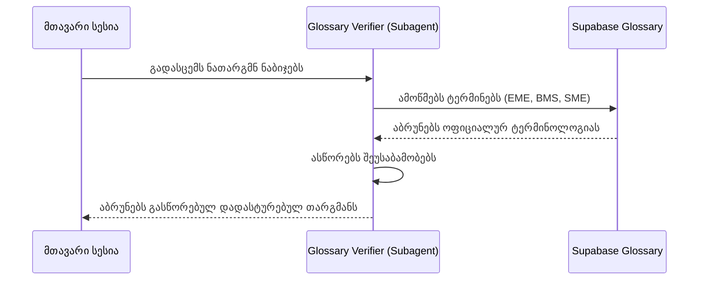
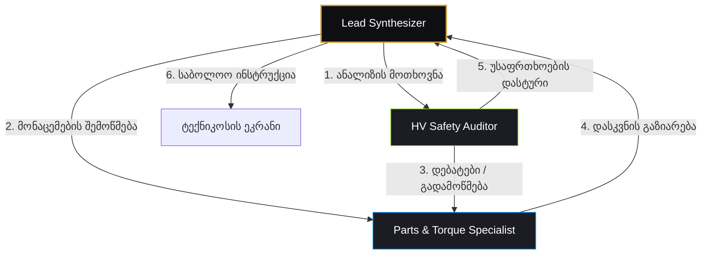
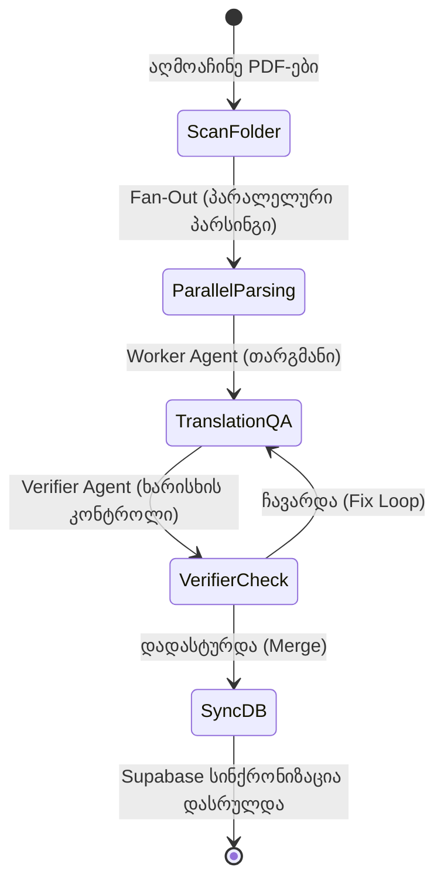

# 🏛️ აგენტების საბჭოს წარდგენა: AI აგენტური გუნდების არქიტექტურის დანერგვის ინოვაციური გეგმა

**სტატუსი:** 🔍 განხილვის პროცესშია (საბჭოს სამუშაო ვერსია)  
**ინიციატორი:** ხელოვნური ინტელექტის არქიტექტორი / Antigravity  
**მიმღები:** Porsche Aftersales ინოვაციების საბჭო (Innovation Council)  
**თარიღი:** 2026-06-05  

---

## 📊 1. შესავალი და ტექნოლოგიური კონტექსტი

Google დოკუმენტში მოცემული Claude Code-ის მოწინავე ორკესტრაციის მექანიზმების შესწავლის საფუძველზე, AI არქიტექტურულმა ჯგუფმა შეიმუშავა ეს წინადადება. Claude Code-ში მრავალაგენტიანი მუშაობის 3 ძირითადი პრიმიტივი არსებობს, რომლებიც საშუალებას გვაძლევს რთული საინჟინრო სამუშაოები დავყოთ პატარა, იზოლირებულ და კოორდინირებულ ამოცანებად:

1. **ქვე-აგენტები (Subagents):** იზოლირებული მუშაკები საკუთარ კონტექსტში (Context Window). ისინი იცავენ ძირითად სესიას ხმაურისგან (ლოგები, გრძელი ფაილები) და აბრუნებენ მხოლოდ შეჯამებულ პასუხებს.
2. **აგენტების გუნდები (Agent Teams):** ორკესტრირებული მრავალპერსპექტივიანი თანამშრომლობა (Lead + Teammates), სადაც აგენტებს შეუძლიათ ერთმანეთთან პირდაპირი საუბარი (Peer-to-peer), აზრთა გაზიარება და საერთო Task List-ის მართვა.
3. **დინამიური სამუშაო ნაკადები (Dynamic Workflows):** JavaScript სკრიპტებით მართული ორკესტრაცია, რომელიც ფონურ რეჟიმში ასრულებს მასობრივ სამუშაოებს, იყენებს ხარისხის ციკლურ კონტროლს (Loop until done), დამოუკიდებელ შემოწმებას (Verifier Loop) და შედეგების სინთეზს.

ეს დოკუმენტი აღწერს, თუ როგორ შეგვიძლია დავნერგოთ ეს სამივე პრიმიტივი **Porsche Repair Instruction Reader** აპლიკაციაში, რათა მივიღოთ 100%-ით სანდო, უსაფრთხო და ავტომატიზებული სარემონტო ინსტრუქციების დამუშავების სისტემა.

---

## 🏗️ 2. სამი კონკრეტული სცენარი Porsche Repair Instruction Reader-ისთვის

### 🌐 სცენარი A (Subagent): თარგმანისა და ლექსიკონის ვერიფიკატორი (Glossary & Translation Verifier)

> [!NOTE]
> **პრობლემა:** PDF-ის დამუშავებისას, Gemini ხშირად თარგმნის ტექნიკურ ტერმინებს ზოგადი ლექსიკონით. Supabase-ის `technical_glossary` ავტომატურად სინქრონიზებულია, თუმცა ძირითად AI სესიაში მთლიანი ლექსიკონის ჩატვირთვა იწვევს კონტექსტის გადავსებას და ტოკენების ხარჯის მკვეთრ ზრდას.

#### 🛠️ გადაწყვეტილების არქიტექტურა
ჩვენ ვქმნით სპეციალიზებულ ქვე-აგენტს: `glossary-verifier` (განისაზღვრება `.claude/agents/glossary-verifier.md` ფაილში).
* **როლი:** წაიკითხოს ნათარგმნი სარემონტო ნაბიჯები და შეადაროს ისინი Supabase-დან ამოღებულ ოფიციალურ ტერმინოლოგიურ ბაზას.
* **უფლებები (Permissions):** Read-only (წვდომა მხოლოდ ლექსიკონის ფაილებზე/Supabase API-ზე).
* **კონტექსტის მართვა:** მუშაობს იზოლირებულ სესიაში. ის იღებს მხოლოდ ნათარგმნ ტექსტს, ასწორებს არაზუსტ ტერმინებს (მაგალითად, "BMS" -> "Battery Management System / ელემენტების მართვის სისტემა", "EME" -> "BMS") და ძირითად სესიას აბრუნებს მხოლოდ გასწორებულ ტექსტს.



* **ბენეფიტი:** ძირითადი საუბრის კონტექსტი რჩება სუფთა, მცირდება API ხარჯი და გარანტირებულია, რომ სარემონტო ინსტრუქცია იყენებს პორშეს სტანდარტულ ქართულ ტერმინებს.

---

### 🛡️ სცენარი B (Agent Team): უსაფრთხოებისა და ნაწილების აუდიტის გუნდი (Safety & Parts Audit Team)

> [!WARNING]
> **პრობლემა:** ელექტროავტომობილების (მაგ. Porsche Taycan) შეკეთებისას, უსაფრთხოების ზომების (მაღალი ძაბვის გამორთვა) ან დაჭერის მომენტების (Torque Specifications) გამოტოვება კრიტიკული საფრთხეა ტექნიკოსის სიცოცხლისთვის და მანქანის გამართულობისთვის.

#### 🛠️ გადაწყვეტილების არქიტექტურა
R&D გარემოში ვრთავთ `Agent Teams` რეჟიმს, სადაც მთავარი აგენტი (Lead Synthesizer) ქმნის და მართავს ორ სპეციალისტ თანაგუნდელს:

1. **🛡️ HV Safety Auditor (მაღალი ძაბვის უსაფრთხოების აუდიტორი):**
   * **ამოცანა:** სკანირებს ინსტრუქციის ნაბიჯებს და ეძებს უსაფრთხოების რისკებს. თუ ინსტრუქცია ეხება მაღალ ძაბვას (High Voltage), ამოწმებს, არის თუ არა გაწერილი დეენერგიზაციის ეტაპი და საჭირო დამცავი ეკიპირება (HV ხელთათმანები, იზოლირებული ხელსაწყოები).
2. **🔧 Parts & Torque Specialist (დაჭერის მომენტებისა და ნაწილების სპეციალისტი):**
   * **ამოცანა:** ამოწმებს, არის თუ არა მითითებული ორიგინალი ნაწილების (OE) კოდები და ხრახნების დაჭერის ზუსტი ძალები (Torque Specs - Nm-ში).
3. **👑 Lead Synthesizer (მთავარი კოორდინატორი):**
   * **ამოცანა:** ანაწილებს ნაბიჯებს, იღებს დასკვნებს თანაგუნდელებისგან, აერთიანებს მათ და ამზადებს საბოლოო, აუდიტირებულ სარემონტო ინსტრუქციას ტექნიკოსისთვის.



* **ბენეფიტი:** ტექნიკოსი არასოდეს მიიღებს ინსტრუქციას, რომელიც არ არის ორმხრივად შემოწმებული უსაფრთხოებისა და ნაწილების კუთხით.

---

### 🚀 სცენარი C (Dynamic Workflow): მასობრივი იმპორტისა და ხარისხის QA ციკლი (Batch Ingestion & QA Loop)

> [!IMPORTANT]
> **პრობლემა:** როდესაც სერვისცენტრში შემოდის ახალი მოდელის 50-მდე სხვადასხვა PDF სარემონტო ინსტრუქცია, მათი სათითაოდ ატვირთვა, თარგმნა, ნაწილების ამოღება და Supabase ბაზაში სინქრონიზაცია ძალიან დიდ დროს მოითხოვს და ადამიანური შეცდომების ალბათობას ზრდის.

#### 🛠️ გადაწყვეტილების არქიტექტურა
ჩვენ ვწერთ JavaScript-ზე დაფუძნებულ `Dynamic Workflow` სკრიპტს, რომელიც მართავს სრულ იმპორტის ციკლს:

1. **კლასიფიკაცია და გადანაწილება (Fan-Out Phase):**
   * სკრიპტი პოულობს ახალ PDF-ებს საქაღალდეში.
   * თითოეული PDF-სთვის პარალელურ რეჟიმში (Worktree იზოლაციით) უშვებს PDF-პარსერ აგენტს ტექსტისა და სურათების გამოსაყოფად.
2. **მრავალდონიანი შემოწმების ციკლი (Verifier Loop & QA):**
   * **Worker Agent:** თარგმნის და აჯგუფებს ნაწილებს.
   * **Verifier Agent:** ამოწმებს, არის თუ არა ნათარგმნი ტექსტი ლოგიკური, ხომ არ აკლია სპეციალური ხელსაწყოების იდენტიფიკატორი.
   * **Judge Agent (Loop Until Done):** თუ რომელიმე ინსტრუქცია არ აკმაყოფილებს ხარისხის კრიტერიუმებს, აბრუნებს უკან გამოსასწორებლად ახალი პრომპტით.
3. **საბოლოო სინთეზი (Synthesis & Sync):**
   * ყველა წარმატებული ინსტრუქცია ჯგუფდება, გადის დუბლიკატების ფილტრაციას და ავტომატურად იწერება Supabase ბაზაში `repair-manuals` Bucket-ში.



* **ბენეფიტი:** მთლიანი სერვისის სახელმძღვანელოების ბიბლიოთეკა მუშავდება და იტვირთება სრულიად ავტონომიურად, 100%-იანი ხარისხის გარანტიით.

---

## 📅 3. საგზაო რუკა და დანერგვის რეკომენდაციები

საბჭოს ვთავაზობთ ეტაპობრივ საორგანიზაციო გეგმას რისკებისა და ტოკენების ხარჯის მინიმუმამდე დასაყვანად:

```
[ეტაპი 1: Subagents] ──► [ეტაპი 2: Agent Teams] ──► [ეტაპი 3: Workflows]
   (დაბალი ხარჯი/რისკი)      (კოლაბორაცია/R&D)       (სრული ავტომატიზაცია)
```

1. **პირველი კვირა (ეტაპი 1):** შევქმნათ `.claude/agents/` დირექტორიაში `glossary-verifier` აგენტი. ეს არის მარტივი და მინიმალური ტოკენების დამზოგავი ნაბიჯი.
2. **მეორე კვირა (ეტაპი 2):** ჩავრთოთ `Agent Teams` R&D რეჟიმში. გამოვიყენოთ `HV Safety Auditor` და `Torque Specialist` მხოლოდ რთული, მაღალძაბვიანი ინსტრუქციების ანალიზისთვის.
3. **მესამე კვირა (ეტაპი 3):** შევიმუშაოთ `.claude/workflows/` საქაღალდეში მასობრივი PDF იმპორტის სკრიპტი.

---

> [!TIP]
> **საბჭოს რეკომენდაცია:** გთხოვთ, გამოთქვათ თქვენი მოსაზრება ამ წინადადებაზე. დამტკიცების შემთხვევაში, ჩვენ დავიწყებთ **პირველი ეტაპის** რეალიზაციას და შევქმნით `glossary-verifier` აგენტის ფაილს.
